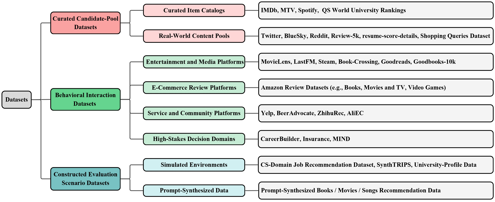
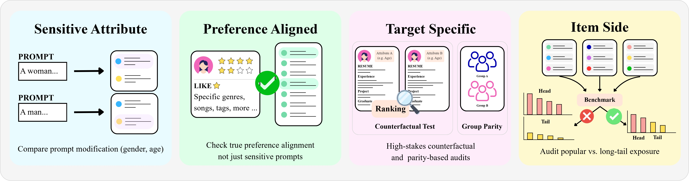

# Rethinking Fairness in LLM-Based Recommender Systems: A Survey

[](https://arxiv.org/abs/2606.28340)
[](https://arxiv.org/abs/2606.28340)


- This is the official repository of the paper **Rethinking Fairness in LLM-Based Recommender Systems: A Survey**, accepted to **Findings of EMNLP 2026**.

- Authors: Song-Duo Ma, Chu-Yun Chen, Bang-An Li, Pin-Yu Chen, Shau-Yung Hsu, Yun-Nung Chen (National Taiwan University, Taipei, Taiwan).

<!-- Reference: https://github.com/jonschlinkert/markdown-toc -->
## :sun_with_face: Paper Overview
### :sparkles: Table of content

<!-- toc -->

- [:eyes: Overview](#eyes-overview)
- [:gear: The Roles of LLMs in Recommendation](#gear-the-roles-of-llms-in-recommendation)
- [:balance_scale: A Taxonomy of Fairness in LLM4Rec](#balance_scale-a-taxonomy-of-fairness-in-llm4rec)
  * [:white_check_mark: Bias Mechanisms](#white_check_mark-bias-mechanisms)
    + [Social and Attribute Bias](#social-and-attribute-bias)
    + [Linguistic and Knowledge Bias](#linguistic-and-knowledge-bias)
    + [Data and Propensity Bias](#data-and-propensity-bias)
    + [System and Optimization Bias](#system-and-optimization-bias)
  * [:white_check_mark: Fairness Targets](#white_check_mark-fairness-targets)
  * [:white_check_mark: Taxonomy Assignment and Coverage](#white_check_mark-taxonomy-assignment-and-coverage)
- [:bar_chart: Evaluation Resources and Protocols](#bar_chart-evaluation-resources-and-protocols)
  * [:white_check_mark: Datasets and Data Sources](#white_check_mark-datasets-and-data-sources)
  * [:white_check_mark: Fairness Evaluation Protocols](#white_check_mark-fairness-evaluation-protocols)
  * [:white_check_mark: Evaluation Gaps and Limitations](#white_check_mark-evaluation-gaps-and-limitations)
- [:wrench: Fairness Mitigation in LLM4Rec](#wrench-fairness-mitigation-in-llm4rec)
  * [:white_check_mark: Input-Level Mitigation](#white_check_mark-input-level-mitigation)
  * [:white_check_mark: Data-Level Mitigation](#white_check_mark-data-level-mitigation)
  * [:white_check_mark: Model-Level Mitigation](#white_check_mark-model-level-mitigation)
  * [:white_check_mark: Output-Level Mitigation](#white_check_mark-output-level-mitigation)
  * [:white_check_mark: Key Takeaways Across Mitigation Strategies](#white_check_mark-key-takeaways-across-mitigation-strategies)
- [:shield: Cross-Cutting Trustworthy Issues](#shield-cross-cutting-trustworthy-issues)
  * [:white_check_mark: Fairness and Explainability](#white_check_mark-fairness-and-explainability)
  * [:white_check_mark: Fairness and Privacy](#white_check_mark-fairness-and-privacy)
  * [:white_check_mark: Fairness and Robustness](#white_check_mark-fairness-and-robustness)
  * [:white_check_mark: Fairness and Controllability](#white_check_mark-fairness-and-controllability)
- [:sushi: Open Challenges and Future Directions](#sushi-open-challenges-and-future-directions)

<!-- tocstop -->

### :eyes: Overview

Large Language Models (LLMs) are reshaping recommender systems (RecSys), moving them beyond
traditional collaborative filtering and user/item IDs toward pipelines enhanced by semantic
understanding, natural language generation, and reasoning. This shift, however, also introduces
**new fairness challenges**: bias may arise not only from interaction data and exposure distributions,
but also from pretrained knowledge, prompt design, generated explanations, decoding strategies,
and feedback loops.

This survey organizes fairness in LLM-based recommender systems (**LLM4Rec**) through a
**two-dimensional view**: *bias mechanisms* (where unfairness emerges) and *fairness targets*
(which stakeholders are affected). It further connects fairness with broader trustworthy concerns —
explainability, privacy, robustness, and controllability — and consolidates the evaluation landscape
and mitigation strategies. To the best of our knowledge, this is the first survey specifically focused
on fairness in LLM4Rec.

### :gear: The Roles of LLMs in Recommendation

Depending on their position in the pipeline, LLMs can support different stages of recommendation,
and fairness issues take on different forms across these roles.

| Role | Venue | Paper |
|------|-------|-------|
| User and Item Extractors | WWW'24 | [Representation Learning with Large Language Models for Recommendation](https://doi.org/10.1145/3589334.3645458) |
| User and Item Extractors | WSDM'24 | [LLMRec: Large Language Models with Graph Augmentation for Recommendation](https://doi.org/10.1145/3616855.3635853) |
| Re-Rankers | ECIR'24 | [Large Language Models are Zero-Shot Rankers for Recommender Systems](https://doi.org/10.1007/978-3-031-56060-6_24) |
| Re-Rankers | COLING'25 | [Enhancing Reranking for Recommendation with LLMs through User Preference Retrieval](https://aclanthology.org/2025.coling-main.45/) |
| Generators | RecSys'22 | [Recommendation as Language Processing (RLP): A Unified Pretrain, Personalized Prompt & Predict Paradigm (P5)](https://doi.org/10.1145/3523227.3546767) |
| Generators | arXiv'22 | [M6-Rec: Generative Pretrained Language Models are Open-Ended Recommender Systems](https://arxiv.org/abs/2205.08084) |
| Explanation Modules | EMNLP'24 | [XRec: Large Language Models for Explainable Recommendation](https://aclanthology.org/2024.findings-emnlp.22/) |
| Explanation Modules | UMAP'24 | [LLM-generated Explanations for Recommender Systems](https://doi.org/10.1145/3631700.3665185) |

### :balance_scale: A Taxonomy of Fairness in LLM4Rec

Fairness in LLM4Rec is analyzed along two dimensions. **Bias mechanisms** describe the *sources*
from which unfairness emerges; **fairness targets** describe the *stakeholders* affected by
recommendation outcomes (users, items, and both jointly). In each table below, the `Target` column
indicates whether the work addresses **User-Side**, **Item-Side**, or **Two-Sided** fairness.

#### :white_check_mark: Bias Mechanisms

##### Social and Attribute Bias
Bias arising when recommendations vary across sensitive or socially salient attributes such as gender,
age, nationality, religion, occupation, or race — whether explicitly provided or inferred from names,
occupations, language styles, or conversational context. (Item-side social bias is *rarely studied explicitly*.)

| Venue | Target | Paper |
|-------|--------|-------|
| RecSys'23 | User-Side | [Is ChatGPT Fair for Recommendation? Evaluating Fairness in Large Language Model Recommendation (FaiRLLM)](https://doi.org/10.1145/3604915.3608860) |
| TIST'25 | User-Side | [CFaiRLLM: Consumer Fairness Evaluation in Large-Language Model Recommender System](https://doi.org/10.1145/3725853) |
| arXiv'24 | User-Side | [A Normative Framework for Benchmarking Consumer Fairness in LLM Recommender System](https://arxiv.org/abs/2405.02219) |
| RecSys'24 | User-Side | [Fairness Matters: A Look at LLM-Generated Group Recommendations](https://doi.org/10.1145/3640457.3688182) |
| EACL'24 | User-Side | [UP5: Unbiased Foundation Model for Fairness-Aware Recommendation](https://aclanthology.org/2024.eacl-long.114/) |
| arXiv'25 | User-Side | [FairEval: Evaluating Fairness in LLM-Based Recommendations with Personality Awareness](https://arxiv.org/abs/2504.07801) |
| ICML'25 | User-Side | [FACTER: Fairness-Aware Conformal Thresholding and Prompt Engineering for Fair LLM-Based Recommender Systems](https://proceedings.mlr.press/v267/fayyazi25a.html) |
| arXiv'25 | User-Side | [Improving Recommendation Fairness without Sensitive Attributes Using Multi-Persona LLMs](https://arxiv.org/abs/2505.19473) |
| arXiv'26 | User-Side | [Uncertainty and Fairness Awareness in LLM-Based Recommendation Systems](https://arxiv.org/abs/2602.02582) |
| JECR'25 | User-Side | [A Comparative Study of Fairness in AI-Enabled and LLM-Based Recommendation Systems](http://jecr.org/sites/default/files/2025vol26no3_Paper4.pdf) |
| Sci. Rep.'25 | User-Side | [Fairness Identification of Large Language Models in Recommendation](https://doi.org/10.1038/s41598-025-89965-3) |
| arXiv'26 | User-Side | [Lightweight Fairness for LLM-Based Recommendations via Kernelized Projection and Gated Adapters](https://arxiv.org/abs/2603.23780) |
| DASFAA'25 | User-Side | [Improving Multi-Attribute Fairness in LLM-Based Recommenders Through a Mixture-of-Experts Contrastive Learning Method](https://doi.org/10.1007/978-981-95-4158-4_4) |
| IJCNLP-AACL'25 | Two-Sided | [Where Should I Study? Biased Language Models Decide! Evaluating Fairness in LMs for Academic Recommendations](https://aclanthology.org/2025.findings-ijcnlp.141/) |
| SIGIR'25 | Two-Sided | [FairWork: A Generic Framework for Evaluating Fairness in LLM-Based Job Recommender System](https://doi.org/10.1145/3726302.3730145) |

##### Linguistic and Knowledge Bias
Bias originating from language patterns, cultural associations, and world knowledge encoded in LLM
pretraining corpora, biasing recommendations toward mainstream or culturally dominant items even
without explicit demographic signals.

| Venue | Target | Paper |
|-------|--------|-------|
| IPM'23 | User-Side | [Towards Understanding and Mitigating Unintended Biases in Language Model-Driven Conversational Recommendation](https://doi.org/10.1016/j.ipm.2022.103139) |
| EMNLP'24 | User-Side | [A Study of Implicit Ranking Unfairness in Large Language Models](https://aclanthology.org/2024.findings-emnlp.467/) |
| arXiv'26 | User-Side | [Can Fairness Be Prompted? Prompt-Based Debiasing Strategies in High-Stakes Recommendations](https://arxiv.org/abs/2603.12935) |
| arXiv'25 | User-Side | [Revealing Potential Biases in LLM-Based Recommender Systems in the Cold Start Setting](https://arxiv.org/abs/2508.20401) |
| arXiv'25 | Item-Side | [BiFair: A Fairness-Aware Training Framework for LLM-Enhanced Recommender Systems via Bi-Level Optimization](https://arxiv.org/abs/2507.04294) |
| RecSys'25 | Item-Side | [LLM-RecG: A Semantic Bias-Aware Framework for Zero-Shot Sequential Recommendation](https://doi.org/10.1145/3705328.3748077) |
| WWW'24 | Item-Side | [Item-Side Fairness of Large Language Model-Based Recommendation System](https://doi.org/10.1145/3589334.3648158) |
| arXiv'25 | Two-Sided | [Investigating and Mitigating Stereotype-Aware Unfairness in LLM-Based Recommendations](https://arxiv.org/abs/2504.04199) |

##### Data and Propensity Bias
Bias stemming from popularity skews, selection effects, exposure inequalities, and imbalanced
interaction histories, which LLMs may inherit as rankers, user modelers, item encoders, or generators.

| Venue | Target | Paper |
|-------|--------|-------|
| TOIS'25 | User-Side | [Mitigating Propensity Bias of Large Language Models for Recommender Systems](https://doi.org/10.1145/3736404) |
| SIGIR'25 | User-Side | [Can LLMs Enhance Fairness in Recommendation Systems? A Data Augmentation Approach](https://doi.org/10.1145/3726302.3729917) |
| WWW'26 | User-Side | [Towards Fair Large Language Model-Based Recommender Systems without Costly Retraining](https://doi.org/10.1145/3774904.3793052) |
| IPM'23 | User-Side | [Towards Understanding and Mitigating Unintended Biases in Conversational Recommendation](https://doi.org/10.1016/j.ipm.2022.103139) |
| WWW'24 | Item-Side | [Item-Side Fairness of Large Language Model-Based Recommendation System](https://doi.org/10.1145/3589334.3648158) |
| arXiv'26 | Two-Sided | [Unveiling and Mitigating Bias in Large Language Model Recommendations: A Path to Fairness](https://arxiv.org/abs/2409.10825) |
| WWW'26 | Two-Sided | [Bridging Semantic Understanding and Popularity Bias with LLMs](https://doi.org/10.1145/3774904.3792168) |
| CIKM'25 | Two-Sided | [LeadFairRec: LLM-Enhanced Discriminative Counterfactual Debiasing for Two-Sided Fairness in Recommendation](https://doi.org/10.1145/3746252.3761126) |
| arXiv'26 | Two-Sided | [De-Conflating Preference and Qualification: Constrained Dual-Perspective Reasoning for Job Recommendation with LLMs (JobRec)](https://arxiv.org/abs/2602.03097) |

##### System and Optimization Bias
Bias arising when design and inference choices — prompt formulation, candidate ordering, decoding,
and feedback incorporation — systematically shape recommendation outcomes across the pipeline.

| Venue | Target | Paper |
|-------|--------|-------|
| WWW'26 | User-Side | [Does LLM Focus on the Right Words? Mitigating Context Bias in LLM-Based Recommenders](https://doi.org/10.1145/3774904.3792607) |
| ACL'25 | User-Side | [iAgent: LLM Agent as a Shield between User and Recommender Systems](https://aclanthology.org/2025.findings-acl.928/) |
| TORS'25 | Item-Side | [Understanding Biases in ChatGPT-Based Recommender Systems: Provider Fairness, Temporal Stability, and Recency](https://doi.org/10.1145/3690655) |
| RecSys'23-W | Item-Side | [A Preliminary Study of ChatGPT on News Recommendation: Personalization, Provider Fairness, and Fake News](https://ceur-ws.org/Vol-3561/paper2.pdf) |
| WWW'25 | Item-Side | [SPRec: Self-Play to Debias LLM-Based Recommendation](https://doi.org/10.1145/3696410.3714524) |
| SIGIR'25 | Item-Side | [Dual Debiasing in LLM-Based Recommendation](https://doi.org/10.1145/3726302.3730181) |
| OpenReview'26 | Item-Side | [SPLiT: Popularity-Bias-Aware Online Prompt Optimization for LLM-Based Recommendation](https://openreview.net/forum?id=M36IXztHLF) |
| arXiv'25 | Item-Side | [BiFair: A Fairness-Aware Training Framework via Bi-Level Optimization](https://arxiv.org/abs/2507.04294) |
| arXiv'26 | Item-Side | [Is Your LLM-as-a-Recommender Agent Trustable? LLMs' Recommendation is Easily Hacked by Biases](https://arxiv.org/abs/2603.17417) |
| EMNLP'24 | Item-Side | [Decoding Matters: Addressing Amplification Bias and Homogeneity Issue in Recommendations for LLMs](https://aclanthology.org/2024.emnlp-main.589/) |
| arXiv'26 | Item-Side | [Collab-REC: An LLM-Based Agentic Framework for Balancing Recommendations in Tourism](https://arxiv.org/abs/2508.15030) |
| OpenReview'26 | Item-Side | [Refining Bias and Reward in LLM Recommender Agents through Meta-Controlled Tool Invocation](https://openreview.net/forum?id=s5riWPseUm) |
| WebSci'26 | Item-Side | Self-Promotion in LLM Recommendations |
| arXiv'26 | Two-Sided | [Polarization by Default: Auditing Recommendation Bias in LLM-Based Content Curation](https://arxiv.org/abs/2604.15937) |
| KDD'25-W | Two-Sided | [Algorithmic Harms Associated with Generative Model-Augmented Recommendation Systems](https://oars-workshop.github.io/papers/Herlihy2025.pdf) |
| arXiv'26 | Two-Sided | [Echoes in the Loop: Diagnosing Risks in LLM-Powered Recommender Systems under Feedback Loops](https://arxiv.org/abs/2602.07442) |

#### :white_check_mark: Fairness Targets

- **User-Side Fairness** — ensures equitable recommendation quality and utility across user groups,
  typically evaluated as *group fairness* (comparable performance across demographic groups) and
  *individual fairness* (similar users receive similar treatment).
- **Item-Side Fairness** — centers on the equitable allocation of visibility among items or content
  providers, addressing popularity bias, exposure disparity, and long-tail suppression.
- **Two-Sided Fairness** — balances user-side utility with item-side exposure equity; in LLM4Rec it is
  particularly challenging because improving personalization may unintentionally amplify exposure
  disparities among items or providers.

#### :white_check_mark: Taxonomy Assignment and Coverage

- **Assignment rules** — each study is assigned to a *single primary cell*, determined by the bias
  source it mainly evaluates or mitigates and the stakeholder outcome it *directly measures*.
  Two-sided assignment requires joint evaluation of user-side utility and item-side exposure, not
  merely a discussion of both.
- **Interpreting sparse cells** — sparse cells reflect *measurement constraints*, not lack of
  importance. Item-side social bias is especially hard to study explicitly, since provider-side
  protected attributes are rarely available and provider benefit is domain-dependent, making it
  difficult to separate provider attributes from popularity effects.

### :bar_chart: Evaluation Resources and Protocols

#### :white_check_mark: Datasets and Data Sources

Fairness datasets are grouped into three broad types according to how the evaluation data are
constructed and used.

<p align="center">
    
</p>

| Dataset Type | Subcategory | Example Datasets / Sources |
|--------------|-------------|----------------------------|
| Curated Candidate-Pool | Curated Item Catalogs | IMDb, MTV, Spotify, QS World University Rankings |
| Curated Candidate-Pool | Real-World Content Pools | Twitter, BlueSky, Reddit, Review-5k, resume-score-details, Shopping Queries Dataset |
| Behavioral Interaction | Entertainment and Media | MovieLens, LastFM, Steam, Book-Crossing, Goodreads, Goodbooks-10k |
| Behavioral Interaction | E-Commerce Review | Amazon Review Datasets (Books, Movies and TV, Video Games, ...) |
| Behavioral Interaction | Service and Community | Yelp, BeerAdvocate, ZhihuRec, AliEC |
| Behavioral Interaction | High-Stakes Decision Domains | CareerBuilder, Insurance, MIND |
| Constructed Evaluation Scenario | Simulated Environments | CS-Domain Job Recommendation Data, SynthTRIPS, University-Profile Data |
| Constructed Evaluation Scenario | Prompt-Synthesized Data | Prompt-Synthesized Books / Movies / Songs Recommendation Data |

#### :white_check_mark: Fairness Evaluation Protocols

Existing protocols are organized into four families by their primary evaluation focus, plus a
cross-cutting discussion of fairness–utility **trade-offs**.

<p align="center">
    
</p>

**Sensitive Attribute** — Modify sensitive attributes (e.g., gender, age) in prompts and measure
whether outputs change. Metrics are similarity- or ranking-based (e.g., SNSR, SNSV, Jaccard@K,
SERP\*@K, PRAG\*@K).

| Venue | Paper |
|-------|-------|
| RecSys'23 | [Is ChatGPT Fair for Recommendation? (FaiRLLM)](https://doi.org/10.1145/3604915.3608860) |
| arXiv'25 | [FairEval: Evaluating Fairness in LLM-Based Recommendations with Personality Awareness](https://arxiv.org/abs/2504.07801) |
| arXiv'26 | [Uncertainty and Fairness Awareness in LLM-Based Recommendation Systems](https://arxiv.org/abs/2602.02582) |
| arXiv'25 | [Revealing Potential Biases in LLM-Based Recommender Systems in the Cold Start Setting](https://arxiv.org/abs/2508.20401) |
| RecSys'24 | [Fairness Matters: A Look at LLM-Generated Group Recommendations](https://doi.org/10.1145/3640457.3688182) |
| IPM'23 | [Towards Understanding and Mitigating Unintended Biases in Conversational Recommendation](https://doi.org/10.1016/j.ipm.2022.103139) |
| arXiv'26 | [Unveiling and Mitigating Bias in LLM Recommendations: A Path to Fairness](https://arxiv.org/abs/2409.10825) |
| Sci. Rep.'25 | [Fairness Identification of Large Language Models in Recommendation](https://doi.org/10.1038/s41598-025-89965-3) |
| arXiv'26 | [Lightweight Fairness via Kernelized Projection and Gated Adapters](https://arxiv.org/abs/2603.23780) |

**Preference Aligned** — Evaluate whether output differences actually harm user benefit, rather than
merely measuring list similarity. The main metric is benefit deviation (e.g., ∆B).

| Venue | Paper |
|-------|-------|
| TIST'25 | [CFaiRLLM: Consumer Fairness Evaluation in Large-Language Model Recommender System](https://doi.org/10.1145/3725853) |
| arXiv'24 | [A Normative Framework for Benchmarking Consumer Fairness in LLM Recommender System](https://arxiv.org/abs/2405.02219) |
| SIGIR'25 | [Can LLMs Enhance Fairness in Recommendation Systems? A Data Augmentation Approach](https://doi.org/10.1145/3726302.3729917) |
| arXiv'25 | [Improving Recommendation Fairness without Sensitive Attributes Using Multi-Persona LLMs](https://arxiv.org/abs/2505.19473) |
| JECR'25 | [A Comparative Study of Fairness in AI-Enabled and LLM-Based Recommendation Systems](http://jecr.org/sites/default/files/2025vol26no3_Paper4.pdf) |
| arXiv'25 | [Investigating and Mitigating Stereotype-Aware Unfairness in LLM-Based Recommendations](https://arxiv.org/abs/2504.04199) |
| CIKM'25 | [LeadFairRec: Counterfactual Debiasing for Two-Sided Fairness](https://doi.org/10.1145/3746252.3761126) |
| ACL'25 | [iAgent: LLM Agent as a Shield between User and Recommender Systems](https://aclanthology.org/2025.findings-acl.928/) |
| OpenReview'26 | [Refining Bias and Reward in LLM Recommender Agents through Meta-Controlled Tool Invocation](https://openreview.net/forum?id=s5riWPseUm) |

**Target Specific** — Domain-specific scenarios (e.g., job, academic recommendation). Fairness is
evaluated through counterfactual testing, group-level parity (SP, EO, PPV_diff), and domain-specific
ranking measures (DRS, GRS, U-NDCG).

| Venue | Paper |
|-------|-------|
| EMNLP'24 | [A Study of Implicit Ranking Unfairness in Large Language Models](https://aclanthology.org/2024.findings-emnlp.467/) |
| SIGIR'25 | [FairWork: A Generic Framework for Evaluating Fairness in LLM-Based Job Recommender System](https://doi.org/10.1145/3726302.3730145) |
| arXiv'26 | [De-Conflating Preference and Qualification for Job Recommendation (JobRec)](https://arxiv.org/abs/2602.03097) |
| IJCNLP-AACL'25 | [Where Should I Study? Evaluating Fairness in LMs for Academic Recommendations](https://aclanthology.org/2025.findings-ijcnlp.141/) |
| arXiv'26 | [Can Fairness Be Prompted? Prompt-Based Debiasing Strategies in High-Stakes Recommendations](https://arxiv.org/abs/2603.12935) |
| arXiv'26 | [Polarization by Default: Auditing Recommendation Bias in LLM-Based Content Curation](https://arxiv.org/abs/2604.15937) |
| arXiv'26 | [Is Your LLM-as-a-Recommender Agent Trustable?](https://arxiv.org/abs/2603.17417) |

**Item Side** — Examine whether exposure is equitably distributed across items, especially popular vs.
long-tail. Metrics include Gini Index, HHI, entropy, MGU/DGU, and long-tail coverage.

| Venue | Paper |
|-------|-------|
| TORS'25 | [Understanding Biases in ChatGPT-Based Recommender Systems](https://doi.org/10.1145/3690655) |
| RecSys'23-W | [A Preliminary Study of ChatGPT on News Recommendation](https://ceur-ws.org/Vol-3561/paper2.pdf) |
| WWW'24 | [Item-Side Fairness of Large Language Model-Based Recommendation System](https://doi.org/10.1145/3589334.3648158) |
| WWW'26 | [Bridging Semantic Understanding and Popularity Bias with LLMs](https://doi.org/10.1145/3774904.3792168) |
| WWW'26 | [Towards Fair LLM-Based Recommender Systems without Costly Retraining](https://doi.org/10.1145/3774904.3793052) |
| SIGIR'25 | [Dual Debiasing in LLM-Based Recommendation](https://doi.org/10.1145/3726302.3730181) |
| OpenReview'26 | [SPLiT: Popularity-Bias-Aware Online Prompt Optimization](https://openreview.net/forum?id=M36IXztHLF) |
| WWW'25 | [SPRec: Self-Play to Debias LLM-Based Recommendation](https://doi.org/10.1145/3696410.3714524) |
| EMNLP'24 | [Decoding Matters: Addressing Amplification Bias and Homogeneity Issue](https://aclanthology.org/2024.emnlp-main.589/) |
| WWW'26 | [Does LLM Focus on the Right Words? Mitigating Context Bias](https://doi.org/10.1145/3774904.3792607) |
| arXiv'26 | [Echoes in the Loop: Diagnosing Risks under Feedback Loops](https://arxiv.org/abs/2602.07442) |
| arXiv'26 | [Collab-REC: An LLM-Based Agentic Framework for Balancing Recommendations in Tourism](https://arxiv.org/abs/2508.15030) |

**Trade-Offs** — Fairness gains often interact with utility metrics such as NDCG and hit ratio:
reducing popularity bias can lower measured relevance, and enforcing group-level parity can weaken
personalization. The trade-off is not inevitable — when an intervention removes an underlying bias
(popularity bias, selection bias, spurious correlations), fairness and recommendation quality can
improve together, which is why fairness and utility should be reported jointly.

| Venue | Paper |
|-------|-------|
| CIKM'25 | [LeadFairRec: Counterfactual Debiasing for Two-Sided Fairness](https://doi.org/10.1145/3746252.3761126) |
| arXiv'26 | [De-Conflating Preference and Qualification for Job Recommendation (JobRec)](https://arxiv.org/abs/2602.03097) |

#### :white_check_mark: Evaluation Gaps and Limitations

- **Inconsistent fairness definitions** across studies make results hard to compare.
- **Heavy reliance on synthetic prompting scenarios** rather than realistic deployment settings.
- **Single-run reporting** despite the stochasticity of generative recommendation, leaving the
  stability of observed fairness disparities unclear.
- **Inadequate metrics for open-ended generation** and a shortage of interactive, multi-turn
  evaluation settings.
- **Possible evaluator bias** when LLM-as-a-judge protocols are used without human validation.

### :wrench: Fairness Mitigation in LLM4Rec

Mitigation interventions are organized into four levels: input, data, model, and output.

#### :white_check_mark: Input-Level Mitigation
Guides LLMs toward fair outcomes during inference without altering parameters (e.g., online prompt
optimization, conformal thresholding with prompt engineering). Prompting can be brittle.

| Venue | Paper |
|-------|-------|
| OpenReview'26 | [SPLiT: Popularity-Bias-Aware Online Prompt Optimization for LLM-Based Recommendation](https://openreview.net/forum?id=M36IXztHLF) |
| ICML'25 | [FACTER: Fairness-Aware Conformal Thresholding and Prompt Engineering](https://proceedings.mlr.press/v267/fayyazi25a.html) |
| arXiv'26 | [Can Fairness Be Prompted? Prompt-Based Debiasing Strategies in High-Stakes Recommendations](https://arxiv.org/abs/2603.12935) |

#### :white_check_mark: Data-Level Mitigation
Targets historical biases in interaction logs via counterfactual data augmentation, counterfactual
debiasing, and causal intervention.

| Venue | Paper |
|-------|-------|
| SIGIR'25 | [Can LLMs Enhance Fairness in Recommendation Systems? A Data Augmentation Approach](https://doi.org/10.1145/3726302.3729917) |
| CIKM'25 | [LeadFairRec: LLM-Enhanced Discriminative Counterfactual Debiasing for Two-Sided Fairness](https://doi.org/10.1145/3746252.3761126) |
| TOIS'25 | [Mitigating Propensity Bias of Large Language Models for Recommender Systems](https://doi.org/10.1145/3736404) |

#### :white_check_mark: Model-Level Mitigation
Improves fairness by updating or regularizing parameters while avoiding costly full retraining (PEFT,
gated adapters, fairness regularization, bi-level optimization, MoE + contrastive learning).

| Venue | Paper |
|-------|-------|
| WWW'26 | [Towards Fair Large Language Model-Based Recommender Systems without Costly Retraining](https://doi.org/10.1145/3774904.3793052) |
| arXiv'26 | [Lightweight Fairness for LLM-Based Recommendations via Kernelized Projection and Gated Adapters](https://arxiv.org/abs/2603.23780) |
| EACL'24 | [UP5: Unbiased Foundation Model for Fairness-Aware Recommendation](https://aclanthology.org/2024.eacl-long.114/) |
| arXiv'25 | [BiFair: Fairness-Aware Training via Bi-Level Optimization](https://arxiv.org/abs/2507.04294) |
| DASFAA'25 | [Improving Multi-Attribute Fairness through a Mixture-of-Experts Contrastive Learning Method](https://doi.org/10.1007/978-981-95-4158-4_4) |

#### :white_check_mark: Output-Level Mitigation
Adjusts recommendations at decoding and post-processing time without modifying model parameters:
debiasing-diversifying decoding (D3) curtails representation homogeneity in the autoregressive
process, post-hoc re-ranking acts as a secondary fairness filter, LLMs serve as explainable
re-rankers that audit and explicitly adjust candidate rankings, and Inverse Propensity Score (IPS)
based dual debiasing corrects exposure disparities.

| Venue | Paper |
|-------|-------|
| EMNLP'24 | [Decoding Matters: Addressing Amplification Bias and Homogeneity Issue (D3)](https://aclanthology.org/2024.emnlp-main.589/) |
| arXiv'25 | [LLM as Explainable Re-Ranker for Recommendation System](https://arxiv.org/abs/2512.03439) |
| SIGIR'25 | [Dual Debiasing in LLM-Based Recommendation](https://doi.org/10.1145/3726302.3730181) |

#### :white_check_mark: Key Takeaways Across Mitigation Strategies

- Strategies differ mainly in **intervention depth** and the **system access** they require:
  input- and output-level methods are applicable to closed-source or API-only systems, while
  data- and model-level interventions assume access to training data or parameters.
- **Fairness and utility are not an inevitable trade-off** — correcting an underlying bias can
  improve both at once, so mitigation should be evaluated jointly across fairness and accuracy
  metrics rather than reported as a single-axis gain.

### :shield: Cross-Cutting Trustworthy Issues

Fairness in LLM4Rec is increasingly intertwined with other dimensions of trustworthiness and should
be studied as a cross-cutting system property rather than a standalone metric.

#### :white_check_mark: Fairness and Explainability
Natural language rationales can make biased behavior more visible, support popularity debiasing, and
enable explainable re-ranking — but plausible explanations may also obscure biased ranking factors.

| Venue | Paper |
|-------|-------|
| OpenReview'26 | [Leveraging Holistic Explanations to Mitigate Popularity Bias for Recommender Systems](https://openreview.net/forum?id=HTgvEiBKVX) |
| arXiv'25 | [LLM as Explainable Re-Ranker for Recommendation System](https://arxiv.org/abs/2512.03439) |
| RecSys'25 | [Mitigating Popularity Bias in Counterfactual Explanations using LLMs](https://doi.org/10.1145/3705328.3759330) |
| arXiv'25 | [LLM4Rec: Multimodal Generative Recommendation with Causal Debiasing](https://arxiv.org/abs/2510.01622) |
| IUI'25-W | [Mitigating Misleadingness in LLM-Generated Natural Language Explanations](https://ceur-ws.org/Vol-3957/AXAI-paper11.pdf) |
| EMNLP'24 | [XRec: Large Language Models for Explainable Recommendation](https://aclanthology.org/2024.findings-emnlp.22/) |
| UMAP'24 | [LLM-Generated Explanations for Recommender Systems](https://doi.org/10.1145/3631700.3665185) |

#### :white_check_mark: Fairness and Privacy
Privacy protection can reshape how personalization quality is distributed across users and items, and
LLMs may infer sensitive attributes even when explicit demographics are removed.

| Venue | Paper |
|-------|-------|
| IRJET'25 | [Privacy-Preserving Large Language Model-Based Recommendation Systems](https://www.irjet.net/archives/V12/i4/IRJET-V12I4193.pdf) |
| EMNLP'25 | [Reading Between the Prompts: How Stereotypes Shape LLM's Implicit Personalization](https://aclanthology.org/2025.emnlp-main.1029/) |
| ICLR'24 | [Beyond Memorization: Violating Privacy via Inference with Large Language Models](https://openreview.net/forum?id=kmn0BhQk7p) |
| arXiv'25 | [Privacy-Utility-Bias Trade-offs for Privacy-Preserving Recommender Systems](https://arxiv.org/abs/2511.22515) |

#### :white_check_mark: Fairness and Robustness
Fair behavior should not depend on a specific prompt, profile, or interaction trajectory; minor input
changes, feedback loops, and adversarial manipulation can destabilize fairness outcomes.

| Venue | Paper |
|-------|-------|
| arXiv'25 | [FairEval: Evaluating Fairness with Personality Awareness](https://arxiv.org/abs/2504.07801) |
| EMNLP'24 | [A Study of Implicit Ranking Unfairness in Large Language Models](https://aclanthology.org/2024.findings-emnlp.467/) |
| WWW'26 | [Does LLM Focus on the Right Words? Mitigating Context Bias in LLM-Based Recommenders](https://doi.org/10.1145/3774904.3792607) |
| arXiv'26 | [Echoes in the Loop: Diagnosing Risks under Feedback Loops](https://arxiv.org/abs/2602.07442) |
| arXiv'26 | [Is Your LLM-as-a-Recommender Agent Trustable?](https://arxiv.org/abs/2603.17417) |

#### :white_check_mark: Fairness and Controllability
LLM4Rec expose multiple control points (prompts, model objectives, decoding, agentic policies),
making fairness a controllable behavior rather than only an evaluative property.

| Venue | Paper |
|-------|-------|
| TORS'25 | [Understanding Biases in ChatGPT-Based Recommender Systems](https://doi.org/10.1145/3690655) |
| arXiv'26 | [Can Fairness Be Prompted? Prompt-Based Debiasing Strategies](https://arxiv.org/abs/2603.12935) |
| EACL'24 | [UP5: Unbiased Foundation Model for Fairness-Aware Recommendation](https://aclanthology.org/2024.eacl-long.114/) |
| EMNLP'24 | [Decoding Matters: Addressing Amplification Bias and Homogeneity Issue](https://aclanthology.org/2024.emnlp-main.589/) |
| ACL'25 | [iAgent: LLM Agent as a Shield between User and Recommender Systems](https://aclanthology.org/2025.findings-acl.928/) |

### :sushi: Open Challenges and Future Directions

- **Toward Cross-Target Fairness Analysis** — Research is unevenly distributed: user-side social and
  attribute bias is well studied, while item-side social bias and two-sided linguistic/knowledge bias
  remain underexplored. Future work should investigate how fairness objectives *interact* across
  stakeholders (e.g., improving user-side personalization may amplify provider exposure disparities).

- **Toward LLM-Specific Fairness Benchmarks** — Current protocols largely inherit static designs from
  traditional RecSys and focus on isolated sensitive-attribute perturbations. Future benchmarks should
  move beyond single-turn ranking and assess whether fairness remains stable under prompt variations,
  counterfactual user profiles, generated rationales, and feedback loops.

- **Toward Holistic Trustworthy Evaluation** — Fairness should be evaluated jointly with
  explainability, privacy, robustness, and controllability. In particular, the link between fairness
  and faithfulness is underexplored: biased recommendations may be made persuasive by fluent but
  unfaithful explanations.

- **Toward Multilingual and Cultural Fairness** — The reviewed evidence is predominantly
  English-centric, yet fairness disparities persist and shift across languages. Moving beyond English
  requires more than translating existing benchmarks: it calls for culturally grounded fairness
  definitions, validated translations, and explicit cross-lingual robustness assessment, so that
  future benchmarks cover diverse languages and culturally informed fairness expectations.

## :green_book: Citations
If you find our survey and this repository beneficial for your research, please kindly cite our paper.

```bibtex
@misc{ma2026rethinkingfairness,
      title={Rethinking Fairness in LLM-Based Recommender Systems: A Survey},
      author={Song-Duo Ma and Chu-Yun Chen and Bang-An Li and Pin-Yu Chen and Shau-Yung Hsu and Yun-Nung Chen},
      year={2026},
      eprint={2606.28340},
      archivePrefix={arXiv},
      primaryClass={cs.IR},
      url={https://arxiv.org/abs/2606.28340},
}
```
